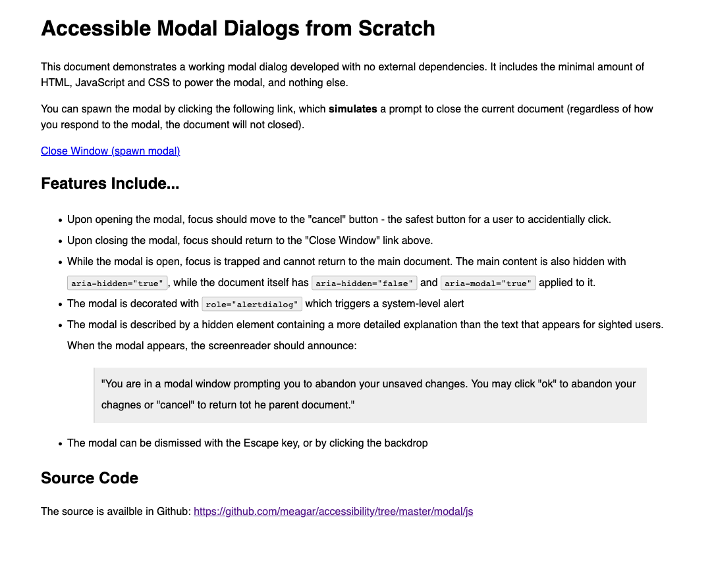
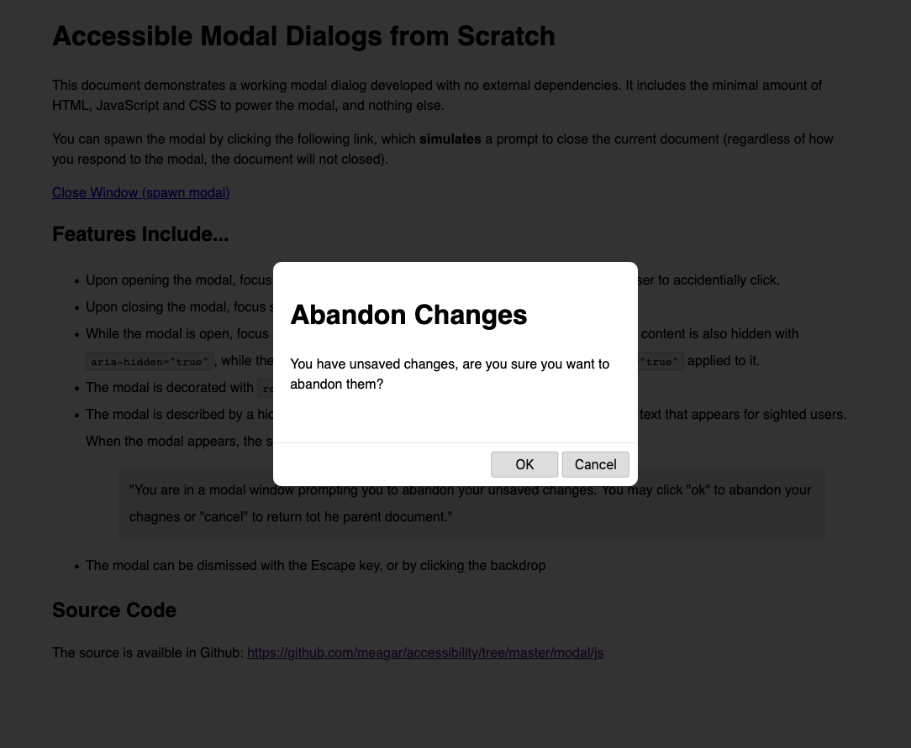

= Accessible Modal Dialogs
Matthew Eagar <meagar@hey.com>
:toc: 

NOTE: This document is incomplete

== Objective

This document outlines how to produce modals dialogs that follow best practices for usability and accessibility for all users, not just persons with impairment.

The focus is on implementation, and the intended audience is technical, primarily developers working in front-end technologies.

== Dialogs and Modals

Dialogs are popup windows that appear over other content.
They’re commonly seen in traditional desktop software, but somewhat rare on the Internet.
Modal dialogs (or “modals”) are dialogs that appear and block the content behind them, forcing the user to focus on the dialog until it is somehow “resolved”.
_Modal_ dialogs are extremely common on the Internet, and there are thousands of libraries for producing them.
This document will build an accessible best-practices modal “from scratch”, with no external dependencies.
The lessons learned should be useful in assessing new and existing modals at, and vetting potential libraries for managing modals.

.Simple website capable of spawning a modal dialog

.A modal dialog obscures the main content

It’s very easy to produce something that appears to be a modal dialog.
From a development standpoint, this typically involves obscuring the document via a backdrop `
` with a semi-transparent background, and centring a modal `
`` over top of the backdrop.
While this dialog may be _visually_ modal, it may not be modal from a functional or accessible perspective.
Dialogs can miss any number of expected user behaviors or necessary accessibility features, and the results range from an inconsistent and frustrating UX to a website that is unusable by people relying on assistive technology.

Some key parts of modal dialogs that are often overlooked:

* Keyboard navigation in the browser does not work well with modals unless specific care is taken to make it work.
    This involves sending focus into the modal and trapping it there, and returning it to the parent document when the modal closes.

 * Modal UX should adhere to best practices in order to meet user expectations.
    This includes dismissing the modal with the Escape key, or by clicking the backdrop.

* Screen readers typically have no idea that modal content is modal content.
    Something that appears visually “front-and-center” and impossible to ignore can actually be invisible to a user depending on assistive technology.
    Additional DOM markup (ie role, aria-hidden and aria-modal) can help assistive technology understand your document as new content is added or revealed, and attributes like aria-labelledby and aria-describedby can provide vital context for users with visual impairment.

== Properties of an Accessible Modal

An accessible modal should have all of the following properties, typically absent from the simplest modal dialog implementations:

* It has `role=”alertdialog”` (for modals) or `role=”alert”` (for non-modals)

* It descends from `<body>`` outside of the main content tree.
    For example, if your content is wrapped in a `
`, the modal’s tree should be a sibling of that div, not descend from it. 

* Provide extra descriptive text for visually impaired users who cannot rely on visual queues that a modal is present, and tied to the modal via `aria-describedby`

* `aria-modal` is set to `true` when the modal is shown, and false when the modal is hidden.
    Additionally, non-modal content receives `aria-hidden=”true”` while the modal is visible, but neither the modal of any ancestor may have `aria-hidden=”true”` applied.

* It must contain at least one clickable element, and focus should move to the first clickable element when the modal is spawned.
    Focus should return to the element that spawned the modal when the modal is dismissed.
    If the modal contains several options, the safest option should be focused by default, so that accidentally clicking a button (ie, by double-pressing the spacebar) performs the safest action.
    For example, a modal that prompts the user “Abandon unsaved changes? Yes/No” should default to “No” so accidental clicks are as non-destructive as possible.

* It traps focus within itself, as long as the modal is visible (it’s impossible via keyboard navigation to “tab” off of the modal, back to elements behind it)

== Building an Accessible Modal

In this section we’ll walk over the critical elements required to build an accessible modal in HTML and JavaScript.
Most of the inessential styling is hidden. For a complete example, skip to 
Baseline Markup and CSS

Markup for modal dialogs typically involves two main components:

* A backdrop or overlay which sits behind the modal, and partially obscures the main content

* A modal container that holds the modal itself

Lets build a basic document that has two regions: One for the pages primary content, within `
` and another to contain the modal and its backdrop, within `
`.`

.Basic scaffold for a document containing a modal dialog
[source, html]
----
<body>
  

    <!-- Main document content appears here -->
  

  

    

      <!-- Modal content appears here and does not descend from `main-content` -->
    

  

</body>
----

TIP: Making the main and modal content *siblings* will be important. This allows us to easily hide the main content by applying a single `aria-hidden` attribute

Next, we'll give the modal itself some content. We'll iteratively improve this markup as we layer on functionality:

.Some simple content within our modal dialog
[source,html]
----

  <h1>This is a modal dialog</h1>
  
You must resolve this dialog before you can continue interacting with the main document.

  <button>Ok</button>

----

Finally, we need a minimal bit of CSS to hide the modal until we want to display it:

[source,css]
----
.modal-content {
    visibility: hidden;
}
----

NOTE: This document skips over a lot of the CSS required to present the modal and its backdrop. For a complete working example, including the minimal amount of CSS, see https://github.com/meagar/accessibility/blob/master/modal/js/[Accessible Modal Dialog Example].

=== Showing the Modal

To show the dialog, there are a series of changes we need to make to the main and modal DOM hierarchies.

A naive approach might simply be to replace `visibility: hidden` with `visibility: visible` on the modal tree.
This would accomplish the *bare minimum* requirement of displaying the modal for sighted users, but from an accessibility standpoint, this solution yields a complete broken modal.

Over the next few sections we'll define a function, `showModal`, that performs all the DOM manipulation required to display our modal dialog in a way that is fully accessible.

=== Modal Visibility

First, the modal content tree should have its `visibility` set to `visible`.
This can be accomplished by manipulating the elements style attribute directly in JavaScript, or by toggling a class on the modal element.
https://getbootstrap.com/docs/4.5/components/modal/[Bootstrap] often uses the `in` class for toggling the display mode of its various dynamic components such as modals and collapsible content areas.
In this solution, we'd have a `.in { visibility: visible }` style in a `<style>` tag or external style sheet, and we'd add the `in` class to the modal DOM hierarchy to display it.
For this document, we'll instead manipulate the elements `style` attribute directly, so that the function we define `showModal` can be completely self-contained and not rely on any external CSS.

.Changing the modals visibility
[source,javascript]
----
document.querySelector('.modal-overlay').
----

The modal element itself must have `role=”dialog”` attribute applied to it:

[source,javascript]
----
document.querySelector('.modal-content')
----

=== Main content visibility

The main content tree must have the `aria-hidden=”true”` attribute applied to it.
This obscures the main content _semantically_ in the same way that the modal overlay obscures it _visually_.
The browser will prevent keyboard navigation from moving back to the main content area, and assistive technology will ignore the main content.

[source,javascript]
----
document.querySelector('.main-content').setAttribute('aria-hidden', 'true');
----

=== Moving Keyboard Focus

With the modal visible and the main content hidden, we must move keyboard focus the a sensible element within the modal dialog.
This is typically the first element in the modal that can receive focus.

Trapping Keyboard Focus
Closing the Modal
Restoring Keyboard Focus
Testing The Modal

    chromevox

    voice over

Further Reading

    A complete functional example of an accessible modal: https://meagar.github.io/accessibility/modal/js/
